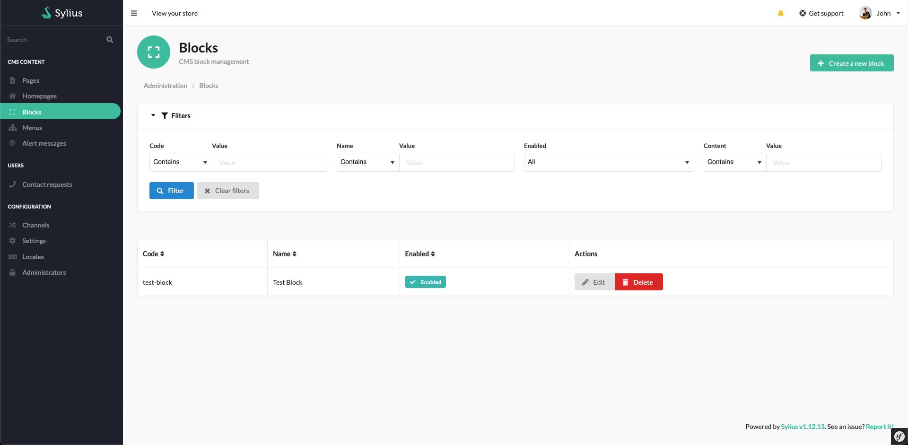
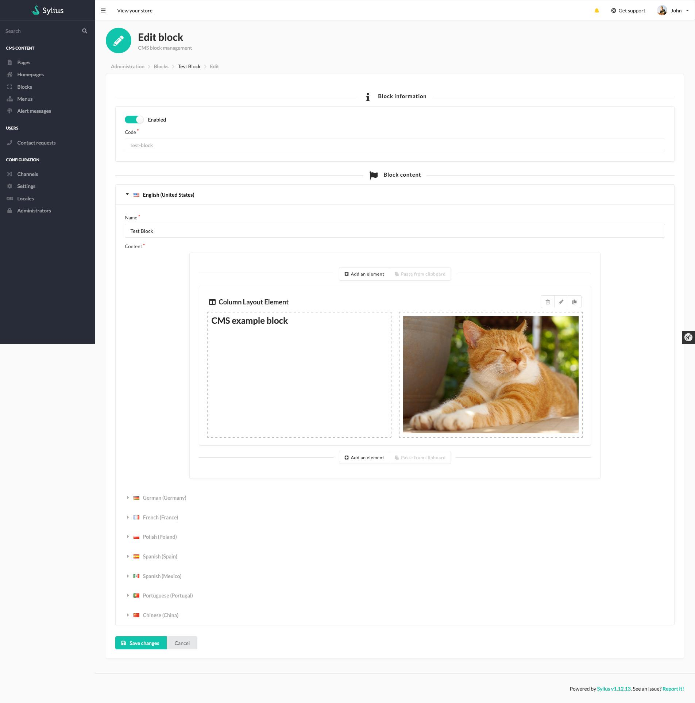
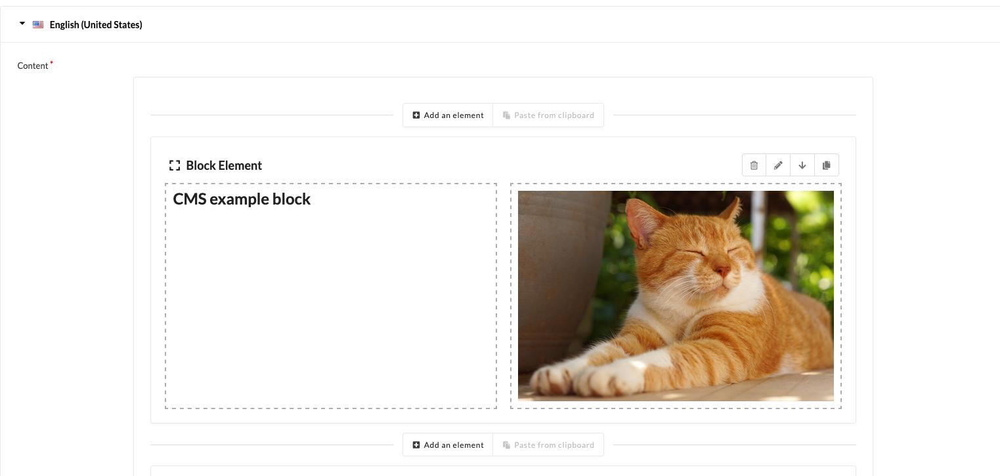
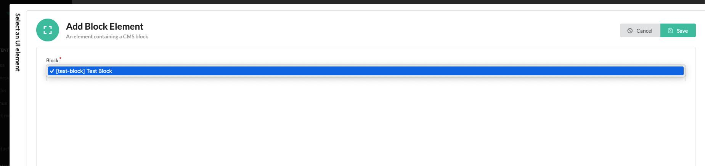
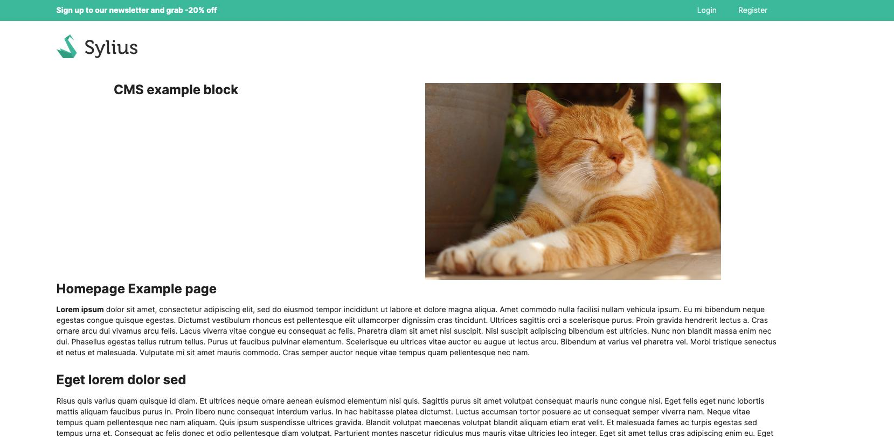

<h1 align="center">Sylius Cms Block Plugin</h1>

[](https://github.com/monsieurbiz/SyliusCmsBlockPlugin/actions?query=workflow%3ATests)
[](https://github.com/monsieurbiz/SyliusCmsBlockPlugin/actions?query=workflow%3ASecurity)
[](https://github.com/monsieurbiz/SyliusCmsBlockPlugin/actions?query=workflow%3ASecurity)

## Compatibility

| Sylius Version | PHP Version     |
|----------------|-----------------|
| 2.0            | 8.2 - 8.3       |

ℹ️ For Sylius 1.x, see our [1.x branch](https://github.com/monsieurbiz/SyliusCmsBlockPlugin/tree/1.x) and all 1.x releases.

## Installation

If you want to use our recipes, you can configure your composer.json by running:

```bash
composer config --no-plugins --json extra.symfony.endpoint '["https://api.github.com/repos/monsieurbiz/symfony-recipes/contents/index.json?ref=flex/master","flex://defaults"]'
```

```bash
composer require monsieurbiz/sylius-cms-block-plugin
```
Change your `config/bundles.php` file to add the line for the plugin :
```php
<?php
return [
    //..
    MonsieurBiz\SyliusCmsBlockPlugin\MonsieurBizSyliusCmsBlockPlugin::class => ['all' => true],
];
```
Then create the config file in `config/packages/monsieurbiz_sylius_cms_block_plugin.yaml` :
```yaml
imports:
    resource: '@MonsieurBizSyliusCmsBlockPlugin/Resources/config/config.yaml'
```
Finally import the routes in `config/routes/monsieurbiz_sylius_cms_block_plugin.yaml` :
```yaml
imports:
    resource: '@MonsieurBizSyliusCmsBlockPlugin/Resources/config/routes.yaml'
```
### Migrations
First, please run legacy-versioned migrations by using command :
```bash
bin/console doctrine:migrations:migrate
```
After migration, please create a new diff migration :
```php
bin/console doctrine:migrations:diff
```
Then run it (if any) :
```php
bin/console doctrine:migrations:migrate
```

## Example

### Admin list

Manage your block in admin



### Admin form

Manage the content of your block, you can decide to disable or enable it to display it anywhere you used it.



### Include it in your content

For example in your [Homepage](https://github.com/monsieurbiz/SyliusHomepagePlugin) ou [CMS Page](https://github.com/monsieurbiz/SyliusCmsBlockPlugin/) !



By using `block` element in your [Rich Editor](https://github.com/monsieurbiz/SyliusRichEditorPlugin/).


Chose the block you want to include in your content.



### Displays in front

You can use it in multiple places, it will shown the same content everywhere.



If you disable the block, it will not be displayed anymore.

## License

This plugin is under the MIT license.
Please see the [LICENSE](LICENSE) file for more information.
